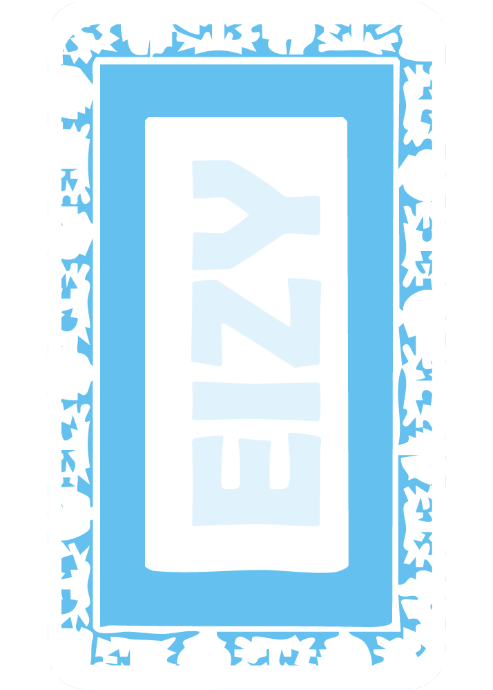

# 🎴 CaidaGO — La Caída Tradicional

<p align="center">
  
</p>

<p align="center">
  <strong>CaidaGO</strong> es una experiencia digital moderna de alto rendimiento desarrollada en <strong>Flutter</strong> y <strong>Dart 3</strong> que rinde tributo al juego de naipes más emblemático de la cultura tradicional venezolana e hispana: <strong>La Caída (con Baraja Española de 40 cartas)</strong>.
</p>

<p align="center">
  
  
  
  
  
  
</p>

---

## 📑 Tabla de Contenidos

1. [Novedades y Actualizaciones Recientes](#-novedades-y-actualizaciones-recientes)
2. [Entrada Directa y Experiencia Visual](#-entrada-directa-y-experiencia-visual)
3. [Reglas y Dinámicas de La Caída](#-reglas-y-dinámicas-de-la-caída)
   - [Jerarquía de Cantos Tradicionales](#-jerarquía-de-cantos-tradicionales)
   - [Mecánicas de Mesa, Caída y Limpia](#-mecánicas-de-mesa-caída-y-limpia)
4. [Consola Flotante de Diagnóstico y Bugs (Debug Logger)](#-consola-flotante-de-diagnóstico-y-bugs)
5. [Economía, Cofres (4 Slots) y Mesas VIP](#-economía-cofres-4-slots-y-mesas-vip)
6. [Perfiles de Jugador, Marcos y Niveles](#-perfiles-de-jugador-marcos-y-niveles)
7. [Tutorial Interactivo (Tour de Novatos)](#-tutorial-interactivo-tour-de-novatos)
8. [Requisitos del Sistema](#-requisitos-del-sistema)
9. [Instalación y Configuración](#-instalación-y-configuración)
10. [Modos de Ejecución y Compilación](#-modos-de-ejecución-y-compilación)
11. [Pruebas Automatizadas y Calidad](#-pruebas-automatizadas-y-calidad)
12. [Arquitectura del Proyecto](#-arquitectura-del-proyecto)
13. [Licencia](#-licencia)

---

## 🌟 Novedades y Actualizaciones Recientes

* 🚀 **Enfoque Exclusivo en CaidaGO**:
  * Eliminación total del módulo de dominó y del compendio genérico inicial para optimizar el rendimiento, peso y experiencia de juego dedicada al 100% a **La Caída**.
  * Inicio directo al compilar en la pantalla de bienvenida estilizada con fondo chevrons púrpura, tipografía 3D abombada y navegación fluida hacia el Lobby.
* 🐞 **Consola Flotante de Diagnóstico y Detección de Bugs en Vivo**:
  * Botón flotante discreto (`DebugInspectorOverlay`), semi-transparente y libremente arrastrable por la pantalla (ícono 🐞).
  * Contador reactivo de errores en tiempo real mediante insignia roja.
  * Consola interactiva (`DebugConsoleModal`) con filtros rápidos (*Todos, Errores ❌, Caída 🃏, Audio 🔊, Sistema ⚙️*), diagnóstico de hardware/sesión, exportación al portapapeles, simulación de excepciones controladas y visor de trazas de pila (*Stack Traces*).
  * Interceptación global de excepciones no controladas mediante `FlutterError.onError` y `PlatformDispatcher.instance.onError`.
* 🎁 **Sistema de 4 Slots de Cofres de Recompensa**:
  * Obtención de cofres tras ganar partidas con temporizador de desbloqueo de 2 minutos.
  * Función de apertura instantánea canjeando 2 Tickets.
  * Recompensas balanceadas de monedas de oro y puntos de experiencia (XP).
* 👤 **Sistema de Perfiles, Niveles y Marcos de Avatar**:
  * Progresión comenzando en **Nivel 0 con 10 tickets y 0 monedas**.
  * Marcos estéticos desbloqueables: Madera Rústica, Neón Celeste, Oro VIP y Amatista Mística.
  * Modal interactivo de perfil con barra de XP animada y estadísticas de victorias.
* ✨ **Animaciones Espaciales 3D y Vuelo de Cartas**:
  * Trayectorias balísticas parabólicas con elevación en el eje Z y rotación dinámica (`CardFlightOverlay`).
  * Marcador dedicado en mesa para la recolección de los 4 Ases.
* 🎴 **Baraja Española Completa en Alta Definición**:
  * 40 naipes artesanales para **Oros, Copas, Espadas y Bastos** (1 al 7, Sota [S], Caballo [C] y Rey [R]).
  * Zonas de aterrizaje en mesa anti-solapamiento con dispersión natural.

---

## 🎬 Entrada Directa y Experiencia Visual

Al abrir la aplicación, el usuario es recibido directamente por:

1. **Pantalla de Bienvenida (`CaidaSplashScreen`)**:
   - Fondo geométrico dinámico con patrón en zigzag (chevrons púrpuras y azul rey).
   - Logotipo principal **CAIDAGO** con relieve 3D, sombras profundas y rótulo "Tradicional".
   - Abanico decorativo de cartas y botón pulsante *"TOCAR PARA ENTRAR"*.
2. **Lobby Principal (`CaidaLobbyScreen`)**:
   - Barra superior con saldo de monedas, tickets y contador de regeneración (1 ticket cada 20 min).
   - Acceso al modal de perfil de usuario y marcos de avatar.
   - Vista de los 4 slots de cofres de recompensa.
   - Modos de juego: Partida Rápida contra Bot, 2 vs 2 por Parejas, Mesas VIP y Escuela Tutorial.

---

## 🎮 Reglas y Dinámicas de La Caída

El juego sigue estrictamente las reglas oficiales de La Caída tradicional venezolana, implementadas en un motor de reglas desacoplado (`CaidaRulesEngine`).

### 🎴 Jerarquía de Cantos Tradicionales (`sealed class Canto`)

Al repartirse las 3 cartas de cada mano, el sistema evalúa automáticamente los cantos presentes:

| Canto | Combinación Requerida | Puntos | Prioridad |
| :--- | :--- | :---: | :---: |
| 🌟 **Trivilín** | 3 cartas del mismo número | **+24 pts** (Gana la partida de inmediato) | 5 (Máxima) |
| 🎖️ **Registro** | Exactamente As, Caballo y Rey (`[1, 11, 12]`) | **+8 pts** | 4 |
| 👁️ **Vigía** | 2 cartas iguales + 1 correlativa ascendente/descendente | **+7 pts** | 3 |
| 🛡️ **Patrulla** | 3 cartas en escalera consecutiva | **+6 pts** | 2 |
| 🎴 **Ronda** | 2 cartas del mismo número | **+1 a +4 pts** (`+1` de 1-7, `+2` Sota, `+3` Caballo, `+4` Rey) | 1 |

* **Regla "Matando Cantos"**: Si ambos bandos tienen cantos, solo cobra los puntos el bando que posea el canto de mayor jerarquía. En caso de empate en rango, cobra quien esté más cerca de la Mano.

### ⚔️ Mecánicas de Mesa, Caída y Limpia

* **Canto de Mesa Inicial**: El repartidor canta de 1 a 4; las coincidencias suman puntos a su favor, mientras que cartas repetidas o sin aciertos otorgan `+1` punto al rival.
* **¡Caída!**: Responder a la carta recién tirada por el jugador anterior con el mismo número otorga puntos (`+1` cartas 1-7, `+2` Sota, `+3` Caballo, `+4` Rey).
* **Arrastre y Seguidilla**: Al emparejar una carta, se recogen dicha carta y todas las consecutivas ascendentes disponibles en el tapete (`1..7, 10..12`).
* **¡Mesa Limpia!**: Levantar todas las cartas del tapete suma `+4` puntos (durante el transcurso del mazo).
* **Bono por Volumen de Cartas**: Al agotarse el mazo de 40 cartas, se cuentan las cartas acumuladas; el excedente sobre 20 (en 2 jugadores) se suma como puntos directos.
* **Meta de Victoria**: 24 puntos oficiales.

---

## 🐞 Consola Flotante de Diagnóstico y Bugs

Para monitorear el estado interno y verificar cualquier anomalía en caliente, la aplicación incorpora una herramienta de diagnóstico en tiempo real:

<p align="center">
  
  
</p>

* **Botón Flotante (`DebugInspectorOverlay`)**:
  * Visible en todas las pantallas y modales.
  * Arrastrable a cualquier coordenada para evitar interferir con la interfaz de juego.
  * Cambia de color a rojo e indica la cantidad de errores cuando se registra una falla.
* **Consola de Registros (`DebugConsoleModal`)**:
  * **Pestañas de filtrado**: `TODOS`, `ERRORES (❌)`, `CAÍDA (🃏)`, `AUDIO (🔊)`, `SISTEMA (⚙️)`.
  * **Panel de diagnóstico rápido**: Identificador de jugador, nivel, XP acumulada, saldo de monedas, tickets disponibles y resolución de pantalla.
  * **Visualizador de Stack Traces**: Trazas de pila expandibles con tipografía monoespaciada para facilitar la depuración inmediata.
  * **Acciones integradas**:
    * 📋 **Copiar Logs**: Exporta todo el historial formateado al portapapeles.
    * ⚡ **Simular Error**: Dispara una excepción de prueba controlada para comprobar la captura en vivo.
    * 🗑️ **Limpiar Historial**: Reinicia el buffer de logs en memoria.

---

## 💰 Economía, Cofres (4 Slots) y Mesas VIP

| Nivel de Mesa VIP | Entrada | Nivel Mínimo | Pozo 1v1 (2 Jugadores) | Pozo Parejas (4 Jugadores) |
| :--- | :---: | :---: | :---: | :---: |
| 🟢 **Novato** | 100 🪙 | Nivel 1 | 184 🪙 *(92 c/u)* | 368 🪙 *(184 c/u)* |
| 🥉 **Bronce** | 500 🪙 | Nivel 3 | 920 🪙 *(460 c/u)* | 1,840 🪙 *(920 c/u)* |
| 🥈 **Plata** | 2,500 🪙 | Nivel 5 | 4,600 🪙 *(2,300 c/u)* | 9,200 🪙 *(4,600 c/u)* |
| 🥇 **Oro** | 10,000 🪙 | Nivel 10 | 18,400 🪙 *(9,200 c/u)* | 36,800 🪙 *(18,400 c/u)* |

* *Comisión de la casa*: **8%** deducido automáticamente del pozo acumulado.
* **Regeneración de Tickets**: 1 ticket cada 20 minutos hasta un tope de 10 tickets.
* **Cofres de Recompensas**: 4 casillas en el lobby con apertura temporizada (2 min) o desbloqueo exprés (2 Tickets).

---

## 👤 Perfiles de Jugador, Marcos y Niveles

* **Perfil Personalizable**: Edición de nombre y selección entre múltiples avatares temáticos.
* **Colección de Marcos**:
  * 🪵 **Madera Rústica**: Marco tradicional de inicio.
  * 💎 **Neón Celeste**: Borde luminoso de alta tecnología.
  * 👑 **Oro Imperial**: Exclusivo para campeones de mesas VIP.
  * 🔮 **Amatista Mística**: Resplandor púrpura de prestigio.
* **Curva de Experiencia**: Ganancia proporcional de XP tras cada partida jugada, victoria o apertura de cofres.

---

## 🎓 Tutorial Interactivo (Tour de Novatos)

Un circuito didáctico de 8 etapas guiadas paso a paso con overlay de reflector (`TutorialSpotlightOverlay`):

1. **Etapa 1 - Caída Básica**: Jugar el mismo valor del rival para anotar caída.
2. **Etapa 2 - Arrastre y Seguidilla**: Capturar escaleras consecutivas en la mesa.
3. **Etapa 3 - Mesa Limpia**: Dejar el tapete vacío (`+4` pts).
4. **Etapa 4 - Canto de Ronda**: Formación y cobro de parejas.
5. **Etapa 5 - Canto de Patrulla**: Escalera de 3 naipes (`+6` pts).
6. **Etapa 6 - Canto de Vigía**: Par más consecutiva (`+7` pts).
7. **Etapa 7 - Canto de Registro**: As, Caballo y Rey (`+8` pts).
8. **Etapa 8 - Clímax de Trivilín**: Victoria instantánea y premio de graduación (**+1000 monedas**).

---

## 🛠️ Requisitos del Sistema

* **Flutter SDK**: `3.29.0` o superior (Canal `stable`).
* **Dart SDK**: `3.7.0` o superior.
* **Git**: Para control de versiones y despliegue.
* **Plataformas Soportadas**:
  * **Android**: API 21+ (Lollipop o superior).
  * **Windows Desktop**: Windows 10/11 con Visual Studio 2022 C++.
  * **Web**: Chrome, Edge, Firefox, Safari (WASM / CanvasKit / HTML).
  * **macOS / iOS / Linux**.

---

## 📥 Instalación y Configuración

```bash
# 1. Clonar el repositorio
git clone git@github.com:eizy-c/GME.git
cd GME

# 2. Descargar paquetes de dependencias
flutter pub get

# 3. Verificar estado del entorno
flutter doctor
```

---

## 🚀 Modos de Ejecución y Compilación

### 1. Modo Web
```bash
# Ejecución en desarrollo
flutter run -d chrome

# Compilación para producción (Web Release)
flutter build web --release
```

### 2. Modo Windows Desktop (.exe)
```bash
# Ejecución en desarrollo
flutter run -d windows

# Compilación ejecutable nativo
flutter build windows --release
```

### 3. Modo Android (APK / AAB)
```bash
# Ejecución en emulador o dispositivo
flutter run -d <device-id>

# Generar APK universal
flutter build apk --release

# Generar App Bundle (Google Play)
flutter build appbundle --release
```

---

## 🧪 Pruebas Automatizadas y Calidad

El proyecto cuenta con un blindaje completo de pruebas unitarias, de integración y de widgets que garantizan la integridad de las reglas y la estabilidad de la interfaz:

```bash
# Ejecutar suite de pruebas completa
flutter test
```
*Resultado*: **106 tests pasando exitosamente (100% pass rate)**.

```bash
# Análisis estático de código
flutter analyze
```
*Resultado*: **0 advertencias / 0 errores**.

---

## 📂 Arquitectura del Proyecto

```text
GME/
├── assets/
│   ├── cards/                 # Naipes en alta definición (Oros, Copas, Espadas, Bastos)
│   │   └── REV-CARD.png       # Reverso oficial azul y dorado
│   └── sfx/cantos/            # Efectos de sonido (Caída, Limpia, Cantos)
├── lib/
│   ├── core/
│   │   ├── models/cards/      # SpanishCard, CardSuit, SpanishDeck
│   │   ├── presentation/      # Widgets base, SpanishCardView, diálogos
│   │   │   └── widgets/       # DebugInspectorOverlay, DebugConsoleModal
│   │   ├── rules/             # GameRulesData (Reglamento oficial de Caída)
│   │   ├── services/          # DebugLogger, AudioService, UserProfileService
│   │   └── stats/             # StatsRepository y GameStats
│   ├── features/
│   │   └── la_caida/
│   │       ├── controllers/   # GameMatchController (Máquina de estados de partida)
│   │       ├── domain/        # CaidaRulesEngine y jerarquía de Cantos
│   │       ├── economy/       # PlayerSession, ChestSlotModel, VipTierOffer
│   │       ├── presentation/  # CaidaSplashScreen, CaidaLobbyScreen, CaidaScreen
│   │       │   └── widgets/   # ChestSlotsView, ProfileModal, CardFlightOverlay
│   │       └── tutorial/      # TutorialEngine, TutorialStep, TutorialScreen
│   └── main.dart              # Punto de entrada directo en CaidaSplashScreen
└── test/                      # 106 pruebas unitarias, de reglas, economía y widgets
```

---

## 📜 Licencia

Desarrollado como una obra cultural y lúdica de libre distribución inspirada en las tradiciones populares hispanas e iberoamericanas. Los recursos gráficos y sonoros han sido creados o seleccionados bajo licencias de uso libre.
